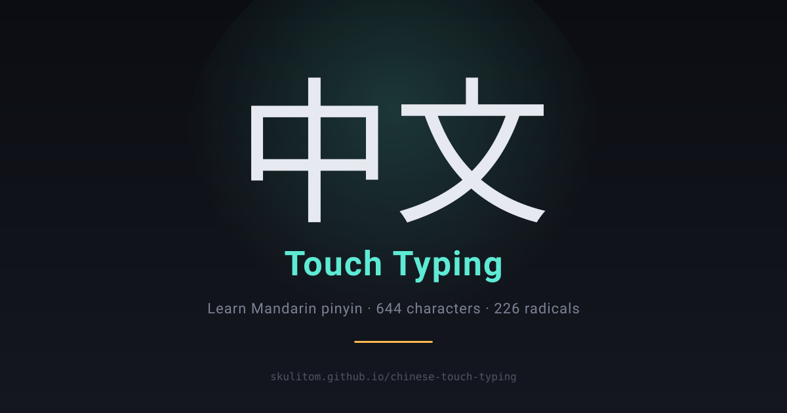

# Chinese Touch Typing · 中文打字练习

A free, browser-based Mandarin **pinyin typing trainer**: see a character, type its pinyin. Covers 644 characters from HSK 1–4 vocabulary plus 226 Kangxi radicals, with adaptive mastery, audio pronunciation and Simplified/Traditional support.

**▶ Try it: https://skulitom.github.io/chinese-touch-typing/**



## Features

- **Five curricula** — Level 1 (100 chars), Level 2 (200), Level 3 (350), All (644), and Radicals (226, plus simplified component variants).
- **Adaptive mastery** — helpers are removed one at a time as you get each character right.
- **Live virtual keyboard** — highlights the key you're pressing and the next one expected.
- **Audio pronunciation** — Mandarin speech via the Web Speech API.
- **Simplified / Traditional** display toggle.
- **Chill mode** — pressure-free exposure practice, with an option to hide the pinyin.
- **22 achievements** for mastery, persistence, speed and practice volume.
- **Tone-coloured pinyin** on a dark-mode interface.
- **Private by default** — progress and settings live in your browser's `localStorage`. No account, no tracking.

## Keyboard shortcuts

| Key | Action |
| --- | --- |
| *letters* | Type the pinyin |
| <kbd>Space</kbd> | Replay pronunciation |
| <kbd>`</kbd> | Mute / unmute |
| <kbd>Esc</kbd> | Reset session |
| <kbd>Shift</kbd>+<kbd>Esc</kbd> | Clear all progress |

## Running locally

It's a single self-contained `index.html` with no build step or dependencies. Open it directly, or serve the folder:

```bash
python -m http.server 8000
```

then visit http://localhost:8000.

## Contributing

Issues and pull requests are welcome.

## License

[MIT](LICENSE)
